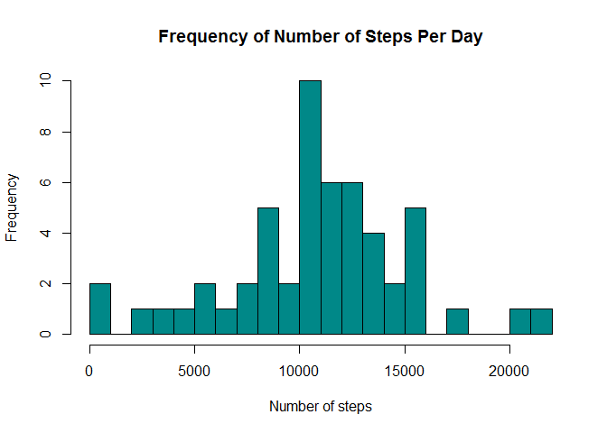
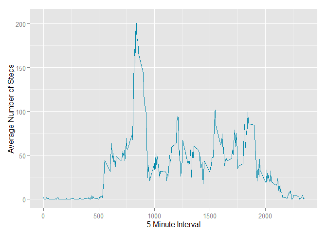
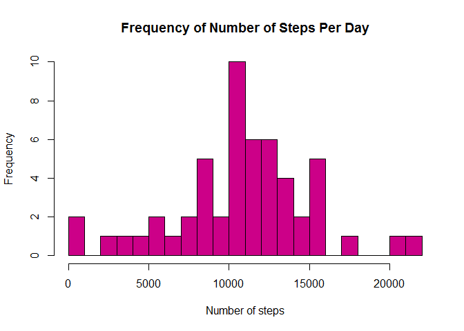
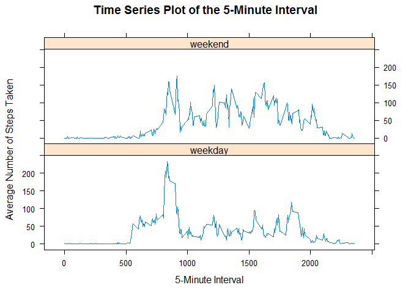

Loading and preprocessing the data
----------------------------------

Records with missing data **NA** are removed from the set

    all_data <- read.csv("activity.csv", colClasses = c("numeric", "Date", "numeric"))
    data <- na.omit(all_data)

What is mean total number of steps taken per day?
-------------------------------------------------

Check if *ggplot2* Library is Loaded

    require(ggplot2)

    ## Loading required package: ggplot2

-   Calculate the Steps per day

<!-- -->

    steps_per_day <- aggregate(steps ~ date, data, sum)

-   Construct a histogram. Breaks are set to **25**

<!-- -->

    hist(steps_per_day$steps,
         breaks = 25,
         main = "Frequency of Number of Steps Per Day",
         xlab = "Number of steps",
         col = "#008888")

-   Mean of the total number of steps taken per day

<!-- -->

    mean(steps_per_day$steps)

    ## [1] 10766.19

-   Median of the total number of steps taken per day

<!-- -->

    median(steps_per_day$steps)

    ## [1] 10765

What is the average daily activity pattern?
-------------------------------------------

    interval <- aggregate(steps ~ interval, data, mean)
    ggplot(interval, aes(x=interval,y=steps)) +
      geom_line(color="#0088aa") +
      labs(x="5 Minute Interval",y="Average Number of Steps")

-   Which 5-minute interval, on average across all the days in the
    dataset, contains the maximum number of steps?

<!-- -->

    interval[interval$steps==max(interval$steps),1]

    ## [1] 835

Imputing missing values
-----------------------

-   Number of NA (missing) step values in the dataset

<!-- -->

    sum(is.na(all_data))

    ## [1] 2304

-   Strategy for filling in all of the missing values Missing step
    values (NA) were replaced by the mean number of steps taken

-   New Dataset with missing data filled in

<!-- -->

    ## merge original activity data frame with interval data frame
    newdata <- merge(all_data, interval, by = 'interval', all.y = F)
    colnames(newdata) <- c("interval", "steps", "date", "meansteps")

-   Histogram of the total number of steps taken per day with imputed
    values

<!-- -->

    newtotal <- aggregate(steps ~ date, newdata, sum, na.rm = TRUE)
    hist(newtotal$steps,
         breaks = 20,
         main = "Frequency of Number of Steps Per Day",
         xlab = "Number of steps",
         col = "#cc0088")

**Do these values differ from the estimates from the first part of the
assignment?**

-   Mean of the total number of steps taken per day

<!-- -->

    mean(newtotal$steps)

    ## [1] 10766.19

-   Median of the total number of steps taken per day

<!-- -->

    median(newtotal$steps)

    ## [1] 10765

Are there differences in activity patterns between weekdays and weekends?
-------------------------------------------------------------------------

-   Create a new factor variable in the dataset with two levels -
    "weekday" and "weekend" indicating whether a given date is a weekday
    or weekend day.

<!-- -->

    weekend <- weekdays(as.Date(data$date)) %in% c("Saturday", "Sunday")
    data$daytype <- "weekday"
    data$daytype[weekend == TRUE] <- "weekend"
    data$daytype <- as.factor(data$daytype)

    ## Show head of dataset adter adding weekend/weekday
    head(data)

    ##     steps       date interval daytype
    ## 289     0 2012-10-02        0 weekday
    ## 290     0 2012-10-02        5 weekday
    ## 291     0 2012-10-02       10 weekday
    ## 292     0 2012-10-02       15 weekday
    ## 293     0 2012-10-02       20 weekday
    ## 294     0 2012-10-02       25 weekday

-   Make a panel plot containing a time series plot

*Make sure lattice library is loaded*

    require(lattice)

    ## Loading required package: lattice

Construct the Plot

    timeplot <- aggregate(steps ~ interval + daytype, data, mean)
    xyplot(
          steps ~ interval | daytype,
          timeplot,
          type = "l",
          layout = c(1,2),
          main = "Time Series Plot of the 5-Minute Interval",
          xlab = "5-Minute Interval",
          ylab = "Average Number of Steps Taken"
    )

